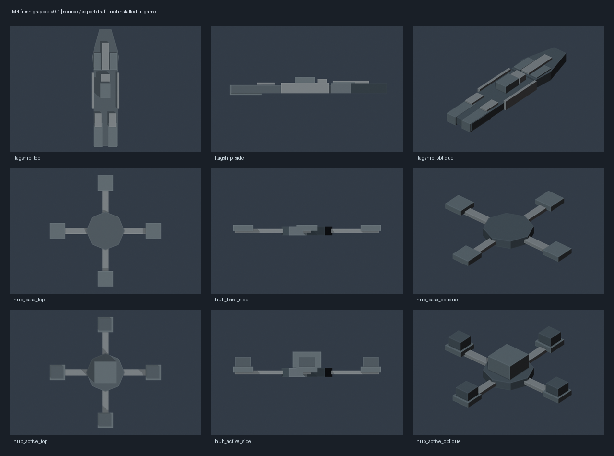

# 里程碑4新旗舰与枢纽灰模 v0.1

日期：2026-10-08。状态：`draft_pending_human_review`。Blender 5.1.2 后台制作，未改动用户已打开的场景。五个网格已完成 PDX 导出回读；当前 Mod 仍使用原版占位模型。

源文件：[reality_assets_graybox_v01.blend](reality_assets_graybox_v01.blend)。模型由本批脚本从基本几何体建立，没有加载旧 Stage 9、旧塔、旧 UV 或贴图。概念与材料方向见[外观方案](../../../docs/art/MILESTONE4_VISUAL_PROPOSAL.md)。灰模只用于比例、阶段区别和接口讨论，不能代表外观已定稿、正式材质或游戏曝光通过。



## 产物与接口

| 网格 | 三角面 | 导出定位器 | 回读 |
| --- | --- | --- | --- |
| `reality_flagship_bow_gray.mesh` | 56 | `large_gun_01/02` | 通过 |
| `reality_flagship_mid_gray.mesh` | 60 | `large_gun_01/02/03` | 通过 |
| `reality_flagship_stern_gray.mesh` | 60 | `large_gun_01`、`engine_large_01/02` | 通过 |
| `reality_baseline_base_gray.mesh` | 124 | `hub_center` | 通过 |
| `reality_baseline_active_gray.mesh` | 184 | `hub_center` | 通过 |

Blender 坐标为 +Y 舰首、+Z 上方，经现有 `io_pdx_mesh` 插件转换。旗舰三个网格共用全舰原点，拟定根实体 `part1/part2/part3` 也在原点；这三个根挂点目前仅记入清单，尚未创建游戏 entity。总长 39.3 Blender 单位。武器挂点名称复用现有设计槽位，朝向、开火与推进效果需实际挂接后检查。

枢纽两阶段中心和四向平台位置一致：基址保留基座、支臂与维护平台；运行态新增中央资料舱与四个屏蔽分析舱。运行机制继续复用既有“占领暂停／夺回续接”状态接口。

`export/` 保存五个 `.mesh` 与五个 64×64 DXT5 灰模贴图（深灰、雾银、蓝灰、spec、normal）。贴图仅用于导出链样品，不是正式材质预算。`graybox_manifest.json` 保存面数、定位器、材质引用回读及九张三视图路径，不使用例行哈希。

## 重建

从项目根目录运行；五个样品 DDS 已随本目录保存。使用本机已安装的 PDX 插件，不在交互场景运行构建脚本：

```powershell
& 'G:\blender\blender.exe' --background --factory-startup --python tools/art/build_milestone4_graybox.py -- --pdx-addon-root 'C:\Users\Admin\AppData\Roaming\Blender Foundation\Blender\5.1\extensions\user_default'
python -X utf8 -B tools/art/prepare_milestone4_graybox_preview.py --pillow-dir temp/ui_build_deps
```

下一步收敛剪影与尺寸，再制作正式材质、目标定位器和独立 entity，接入游戏后做一次正常显示与战斗检查。本批不替换运行模型，也不把文件回读写成游戏验证。
