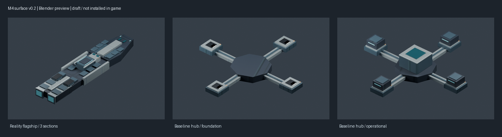

# 新旗舰与两阶段枢纽材质样品 v0.2

日期：2026-10-08。状态：`draft_pending_human_review`；`runtime_installed = false`。这是可导出、可评审的带材质模型草案，尚未替换游戏中的占位模型。



源文件：[reality_assets_surface_v02.blend](reality_assets_surface_v02.blend)。从本项目新建的[灰模v0.1](../milestone4_graybox/README.md)细化，保留灰模源文件；没有使用旧Stage 9、旧塔的几何体、UV或贴图。三个舰段仍共用全舰原点，两阶段枢纽保留共同基座和四向模块中心。

本版增加可更换装甲、恒定模块框、舰桥观察窗、散热格栅、推进喷口、运输轨和维护口。主色与材质职责沿用已批准的[中央庭公共校准板](../../../docs/art/calibration/CENTRAL_COURT_MATERIAL_CALIBRATION.md)，没有把校准板或概念图复制成运行贴图。低亮冷青限于导航、恒定状态与解析舱，小面积琥珀标识有人维护的位置。首版仍是简化工程造型，细节密度与最终轮廓未定稿。

## 导出资源

| 网格 | 三角面 | 定位器 | 文件回读 |
| --- | ---: | --- | --- |
| `reality_flagship_bow.mesh` | 368 | `large_gun_01/02` | 通过 |
| `reality_flagship_mid.mesh` | 496 | `large_gun_01/02/03` | 通过 |
| `reality_flagship_stern.mesh` | 504 | `large_gun_01`、`engine_large_01/02` | 通过 |
| `reality_baseline_base.mesh` | 364 | `hub_center`、`build_point` | 通过 |
| `reality_baseline_active.mesh` | 528 | `hub_center`、`build_point` | 通过 |

每个网格使用一个材质，五个网格共用一套1024×512图集，`export/`中保留三张可重建PNG及对应DXT5 DDS。精确结果以[model_manifest.json](model_manifest.json)及[surface_manifest.json](surface_manifest.json)为准。

通道按本机4.5.2的 `gfx/FX/standardfuncsgfx.fxh` 和 `pdxmesh_ship.fxh` 核对：法线G为X、A为翻转后的Y、R重复G，B为低强度发光；属性图R为帝国染色遮罩（本样品为0），G为反射强度、B为金属度、A为光泽度。Blender预览节点解包同一DDS，仅供离线比较，不代表游戏曝光。

`export/_reality_surface_meshes.gfx`使用实际导出shape名注册五个网格；`export/_reality_surface_entities.asset`提供三段舰体及两阶段枢纽的六个实体。根实体保留 `part1/2/3` 原点挂接，目标定位器使用本机原版战列舰中的 `target_locator_1`～`4`。推进、武器、命中、死亡、尺寸与建造表现仍需在游戏检查，本样品未添加推进／死亡粒子或动画。属性图的反射和发光数值仍待游戏调整；远景mipmap与贴图预算在实际接入时收口。

样品GFX的预定资源路径为 `gfx/models/milestone4_surface_v02/`，目前文件仅在本目录。后续只复制已验收的 `.mesh/.dds/.gfx/.asset`，分别切换旗舰根／三个区段以及枢纽两阶段引用；不能把“样品路径存在”记录成已安装。实际入Mod时再登记正式ASSET身份。

## 重建与续接

在项目根目录运行，Blender只使用独立后台进程：

```powershell
& 'G:\python\python.exe' -X utf8 -B tools/art/prepare_milestone4_surface.py --pillow-dir temp/ui_build_deps
& 'G:\blender\blender.exe' --background --factory-startup --python tools/art/build_milestone4_surface.py -- --pdx-addon-root 'C:\Users\Admin\AppData\Roaming\Blender Foundation\Blender\5.1\extensions\user_default'
& 'G:\python\python.exe' -X utf8 -B tools/art/prepare_milestone4_surface_preview.py --pillow-dir temp/ui_build_deps
```

下一次从本版完成尺寸、粒子及独立路径接入，进行一次旗舰显示／推进／开火和两阶段枢纽显示检查；复用既有唯一舰、90日恢复、占领暂停／夺回恢复证据。外观定稿与游戏验证分别记录。本批保存边界见[续接报告](../../../reports/milestone4_surface_assets_2026-10-08.md)。
