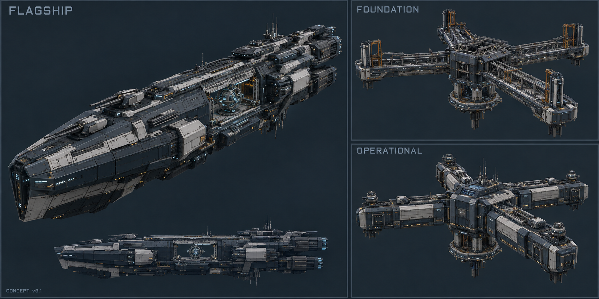

# 里程碑4首批正式外观方案

日期：2026-10-07。状态：`draft_pending_human_review`。

本方案把已可玩的现实恒定旗舰、两阶段基线枢纽与十人肖像整理为可制作的正式外观任务。公共风格、角色识别和机制复用已批准基线；新舰／新枢纽的最终外观仍待确认。本次产物是概念草案与制作接口，不表示完成模型、导出或游戏显示。

2026-10-08制作进度：前三套代表肖像及剩余六人透明肖像均已接入，正常核心通讯与关键新档读回通过，爱缪莎沿用既有资源；详见[六人补齐记录](../../reports/milestone4_remaining_portraits_2026-10-08.md)。旗舰三段与枢纽两阶段的新[Blender灰模及PDX样品](../../art/models/milestone4_graybox/README.md)已保存、导出回读通过，见[首批制作记录](../../reports/milestone4_portraits_and_graybox_2026-10-08.md)。灰模未接入游戏，外观草案状态保持；正式材质、目标挂点和entity仍待制作。

当晚续作：[带材质样品v0.2](../../art/models/milestone4_surface_v02/README.md)已增加装甲／维护结构、有限状态灯、共用图集与GFX／独立实体样品，五个网格回读及三张离线预览通过；尚未安装到游戏或定稿。远景贴图、推进／死亡效果、尺寸与实际显示为下一批，见[续接记录](../../reports/milestone4_surface_assets_2026-10-08.md)。

[原尺寸概念板](../../art/concepts/milestone4_20261007/flagship_baseline_concept_v01.png) · [完整提示词与生成检查](../../art/concepts/milestone4_20261007/README.md) · [生产清单](ASSET_PRODUCTION_PLAN.md) · [本地盘点](../../reports/milestone4_asset_inventory_2026-10-07.json)

## 共同外观

沿用[中央庭公共校准板](calibration/CENTRAL_COURT_MATERIAL_CALIBRATION.md)的深海军蓝／石墨蓝灰主体、雾银承力边、有限暖灰白面板、低亮冷青状态光和少量琥珀人居灯。主结构采用陶瓷／复合装甲、涂层金属、可维护接口和明确分舱。

实体工程保持视觉主体。神器装置只在局部表现受控异常，光效承担状态与流向。不给全舰铺牌面、黄金、晶体、法阵或裂隙；枢纽采用公共设施语言，人物签名不得成为文明通用纹样。

## 现实恒定旗舰

### 概念方向

- 一级剪影为纵向作战舰：钝角楔形舰首、承力脊柱、分层装甲和清楚的舰艉推进端。
- 舰首保留可见主武器与观测；中段为受到工程外框支撑的恒定装置及指挥／维护区；舰艉承担供能、散热与推进。
- 恒定装置是有限任务模块。开启时只增加模块附近的状态光与局部规则表现，不把整个舰体变成粒子。
- 体量仍按现有独立舰种与事件固定设计制作，不新增舰型、武器系统或万能舰队效果。同一时间一艘、90日免费恢复及角色保留沿用机制。

### 模型接口

现有 `aemusa_reality_flagship` 使用 `part1／part2／part3` 连接 `bow／mid／stern`。正式资源独立放入拟定目录 `mod/gfx/models/ships/aemusa_reality_flagship/`，保留这些区段接口及既有设计槽位。

交付包含源模型、三个可拼接网格、定位器、贴图和entity定义；新asset身份在正式接入时登记。参考旧导出工具的接口经验可以复用，不复用旧Stage 9网格、UV、贴图或名称身份。

第一步只用灰模确定同一套正／侧／俯视比例、区段原点、武器与推进挂点，再做一次最小导出与游戏显示。三角面、贴图分辨率和发光预算根据实际导出链确定，不拿概念图细节直接充当预算。

### 草案需收敛处

概念板的大面积浅灰偏多，应回到深蓝灰主体与雾银辅助的材料职责。长桅杆、密集细节和小挂件在远景容易消失，模型只保留支持剪影与功能的结构。侧视图与主视图仅提供方向，不能作为精确尺寸蓝图。

## 现实基线枢纽

### 概念方向

采用“中枢体＋四向水平支臂＋维护／防护框”：中心提供屏蔽、控制与资料汇总，支臂承载观测和分析模块。低而宽的工程平台与纵向旗舰区分，不沿用旧命运塔。

| 已实现阶段 | 正式外观方向 | 玩家应读到的信息 |
| --- | --- | --- |
| 基址 | 共同承重框架、维护平台、已固定的分析接口；尚无完整封装模块 | 建设完成，但运行设备尚待升级 |
| 运行态 | 在同一骨架和接口加装屏蔽分析舱、资料模块与有限冷青状态光 | 已能提供基线与解析 |
| 占领暂停／控制恢复 | 保留运行态实体；原生提示／状态显示说明暂停与恢复，必要时只改变局部状态表现 | 旧资料保留，控制恢复后继续 |

占领与恢复不是新建造阶段，不追加第三／第四种巨构或新规则。概念板两阶段应在灰模中统一实际基座、轴线、支臂长度和连接原点；透视相近不等于已经精确一致。

### 模型与界面接口

拟定独立目录为 `mod/gfx/models/megastructures/aemusa_reality_baseline/`，对应现有 `aemusa_reality_baseline_0／1` 的两种entity。图标保留四个接口名：

- `GFX_aemusa_reality_baseline_0_build_icon`
- `GFX_aemusa_reality_baseline_1_build_icon`
- `GFX_aemusa_reality_baseline_0_outliner_icon`
- `GFX_aemusa_reality_baseline_1_outliner_icon`

先制作两种阶段剪影，建造与总览可复用阶段纹理；若目标尺寸差异需要再导出，不把四个名称自动变成四幅独立原画。事件建设背景优先复用已有规格，只补实际显示缺口。

## 十人肖像首批样品

现有爱缪莎基础与30级透明UI沿用，正式终局形态单独设计。其他九人先补独立基础肖像，随后统一接入既有领袖与通讯。

首批选安托涅瓦、晏华和拉比：前两人覆盖元首／内阁及男性肖像，拉比覆盖人物与阿米特共同取景的特殊情况。素材从已有批准锚点及本地参考开始，只对确需的新画面生成；参考图片不直接进入发布目录。

| 内容 | 目标规格／规则 |
| --- | --- |
| 制作源 | 独立透明PNG，保留人物识别、脸部、发型、服饰与必要神器；拉比／阿米特共同构图 |
| UI输出 | 575×380透明DDS、DXT5，沿用约210×350主体范围；实际裁切按人物调整 |
| 游戏接入 | 独立portrait定义，刷新既有领袖；不新建或替换人物实体 |
| 代表检查 | 元首／内阁、领袖列表／详情、通讯；一次职业往返与关键读档检查身份和肖像保留 |
| 后续批量 | 安、赛斯、幽桐、格蕾莎、雯梓、丽；不默认额外觉醒变体 |

脸部位置、武器或神器可辨性以小尺寸实际界面为准。审批只针对新画面与最终显示，不重审已经确定的角色基础设定。

## 本批之后

1. 按概念板确认或调整新舰／枢纽方向，再制作可导出的灰模；肖像样品可同时按既有锚点准备。
2. 代表样品的尺寸、导出和游戏显示稳定后，扩展剩余人物与正式模型／贴图。
3. 爱缪莎命运主宰独立形态另做可评审方案：合法转变结果触发，30级成长版不能充当终局外观。
4. 随功能整理白夜馆、图标和提示；全线文本与平衡集中收口。
5. 发布前完整衔接回归与关键结局检查，注明受控来源和实际测试版本，再形成安装包／旧档说明。

本次仅准备制作清单、概念板和接口，没有修改mod或推进游戏。原2245.03.02基线的最后确认状态见[十人收口](../../reports/milestone3_ten_character_closeout_2026-10-07.md)，下一次操作游戏前重新确认实时画面。
