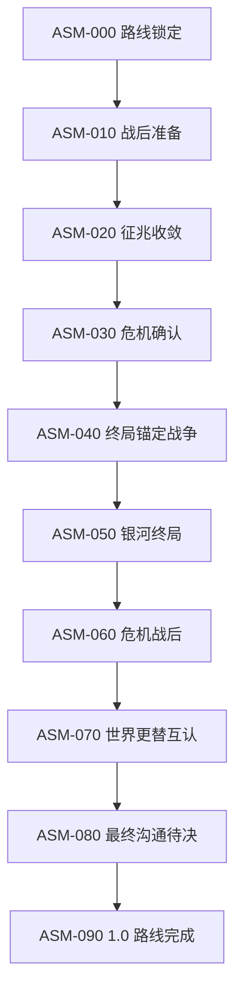

# 爱缪莎专属终局天灾状态机蓝图 v1.0

## 1. 文档职责

本文是专属终局天灾联合叙事审核完成后的第一份机制蓝图，只负责定义：

1. 主线与专属天灾的全局状态。
2. 状态之间允许发生的转换。
3. 每个转换的前置条件、一次性要求与恢复边界。
4. 专属舰、专属巨构、爱缪莎和危机资产失效时，主线如何暂停或继续。
5. 保存、读档、重复触发、多人和异常中断时必须保持的状态不变量。
6. 胜利、局部失败和自然败亡如何进入状态机。

本文不包含：

- Stellaris 事件 ID、flag、变量名、作用域或具体脚本。
- 舰队数量、时间、资源、战斗数值和奖励。
- 终局锚点内部生命周期细节；该内容由下一份蓝图负责。
- 专属舰和专属巨构的完整机制卡。
- 正式舰名、巨构名、美术、声音或 UI 资源。
- 任何旧 Stage 9、旧命运观测塔或旧超规格槽位的复用决定。

状态机蓝图全部审核通过前，隔离原型和正式实现闸门保持关闭。

## 2. 权威上游

本文必须服从：

- [`../design/aemusa_exclusive_endgame_crisis_joint_design_v1.0.md`](../design/aemusa_exclusive_endgame_crisis_joint_design_v1.0.md)
- [`../design/aemusa_main_story_chapter_outline_v1.0.md`](../design/aemusa_main_story_chapter_outline_v1.0.md)
- [`../design/v1.0_narrative_constraints.md`](../design/v1.0_narrative_constraints.md)
- [`../../knowledge/world/v1.0_truth_revelation_matrix.md`](../../knowledge/world/v1.0_truth_revelation_matrix.md)
- [`../../knowledge/characters/aemusa_fate_sovereign_ability_boundary_v1.0.md`](../../knowledge/characters/aemusa_fate_sovereign_ability_boundary_v1.0.md)

已锁定的顺序：

> 常规银河发展 → 失落帝国战争 → 玩家选定并完成一种原版天灾 → 战后准备与专属资产解锁 → 专属终局天灾三阶段 → 危机后真相 → 最终沟通与授权 → 命运主宰

## 3. 设计原则

### 3.1 单向推进

- 主状态只能向前转换，不能因月结、读档、切换界面或重复事件回到旧阶段。
- 每个主状态只允许初始化一次。
- 已经发放的资产解锁、完成的调查、公开的信息和发生的损失不因恢复流程撤销。

### 3.2 主状态与可恢复故障分离

- 专属舰被摧毁、专属巨构失效、爱缪莎暂时不可用或关键调查中断，不得把主状态退回上一阶段。
- 这些情况使用独立的“运行覆盖状态”记录。
- 已正式开始的即时危机不会因主线暂停而冻结；玩家只能通过恢复资产、救援和现实行动重新取得主动。

### 3.3 一次性危机

- 玩家选定的原版天灾在每局主线中只计一次，选择后不能更换。
- 专属终局天灾每局只进入一次正式流程。
- 胜利、路线完成或玩家自然败亡后，不得再次初始化专属危机。

### 3.4 不设置无预警剧情判负

- 局部失败可以造成永久损失，并加重剩余危机压力。
- 状态机不使用一次战斗、单个事件按钮或隐藏倒计时直接删除整个玩家帝国。
- 若玩家国家在正常战争和危机过程中被彻底消灭，游戏可按 Stellaris 原有规则自然结束；这不是额外剧情按钮判负。

### 3.5 危机期间没有命运权限授权

- 危机阶段只使用爱缪莎已经成长出的有限观测与有限干涉能力。
- 玩家授予完整命运权限，只能发生在危机胜利、世界更替真相互认和第五阶段全部剧情结束后的最后沟通。

## 4. 状态数据分层

状态机需要四类概念数据。本文只定义意义，不指定脚本实现。

| 数据层 | 作用 | 核心要求 |
| --- | --- | --- |
| 主路线状态 | 表示整条专属终局路线进行到哪里 | 同一时刻只能有一个主状态；只能向前 |
| 运行覆盖状态 | 表示暂停、恢复、资产失效或特殊阻塞 | 不改变主状态，不重放阶段初始化 |
| 资产状态 | 表示专属舰和专属巨构是否锁定、可建、运行、损失或恢复 | 两项资产分别记录，不能互相代替 |
| 一次性账本 | 记录已选原版天灾、已执行转换、已发奖励和已公开真相 | 读档与重复触发时用于幂等检查 |

## 5. 主状态提案

### ASM-000：路线锁定

含义：

- 爱缪莎主线尚未到达专属天灾准备阶段。
- 失落帝国战争或玩家选定的原版天灾尚未按主线要求完成。
- 专属舰与专属巨构尚未通过本路线解锁。

允许行为：

- 记录上游主线进度。
- 锁定玩家选择的原版天灾类型。
- 不生成专属天灾征兆、锚点、投影或专属资产。

### ASM-010：战后准备

进入意义：

- 失落帝国战争已经位于历史前序。
- 玩家选定的一种原版天灾已经完成，未选择的三种不再进入本局路线。
- 爱缪莎进入更强的局部命运干涉阶段。
- 专属舰与专属巨构获得研究、建设或事件接入资格。

状态性质：

- 这是重大阶段之间的可无限期准备状态。
- 不因玩家处理其他银河事务而自动失败。
- 不生成正式终局锚点和天灾投影。

### ASM-020：征兆收敛

含义：

- 专属危机第一阶段已经开始。
- 爱缪莎发现多个无关未来分支同时失去成立条件。
- 中央庭科研体系与外部记录开始形成独立证据链。

状态目标：

- 完成爱缪莎观测、文明科研与外部记录三条证据链。
- 识别“许多不同风险正在压向同一毁灭结果”。
- 仍不生成大规模天灾舰队，不公开全部终局真相。

### ASM-030：危机确认

含义：

- 三条证据链已经汇合。
- 文明确认旧七日毁灭结果正在重新作用于现实。
- 尚未知道当前世界与旧轮回世界并非同一个世界。

状态职责：

- 锁定专属危机身份模型。
- 完成进入锚点战争前的最后准备、公开、救援与资产检查。
- 此状态结束后，专属危机成为已经正式发生的即时危机，不再受普通主线暂停保护。

### ASM-040：终局锚定战争

含义：

- 专属危机第二阶段已经开始。
- 部分地区被压缩到只剩毁灭结果。
- 专属舰将局部毁灭恒定为可处理的终局锚点。
- 锚点使用当地现实材料生成无人格舰队与设施投影。

状态目标：

- 保护现实目标和专属舰。
- 获取锚点、投影、战斗和残骸数据。
- 由专属巨构逐步破解结构弱点。
- 摧毁现实载体，并由爱缪莎重新打开局部非毁灭未来。

状态边界：

- 只摧毁投影不能永久完成阶段。
- 专属舰、巨构或爱缪莎暂时不可用时，危机不会退回 `ASM-030`。
- 未及时处理的局部区域可以真实毁灭。

### ASM-050：银河终局

含义：

- 专属危机第三阶段已经开始。
- 多个终局锚点和收敛结构彼此关联，开始把玩家文明及其深度相连区域压向共同毁灭终点。

状态目标：

- 处理承担不同现实功能的核心锚点和收敛结构。
- 维持专属舰局部可交战窗口。
- 使用专属巨构完成全局定位、协调和弱点破解。
- 由玩家文明、盟友、舰队、科研、救援体系和爱缪莎共同完成最终解除。

禁止：

- 不出现人格化首领、外交国家或“击杀首领即胜利”的唯一节点。
- 不让专属舰、巨构或爱缪莎任一方单独自动胜利。

### ASM-060：危机战后

含义：

- 本轮现实中的专属终局天灾已经被击败。
- 旧毁灭结果失去本轮现实的支配力。
- 已经真实毁灭的地区不会自动恢复。

状态职责：

- 停止新的正式锚点初始化。
- 处理剩余无人格投影、救援、损失结算和战场证据。
- 保留文明可以独立验证的危机事实。
- 准备进入爱缪莎的危机后窥见，而不是立即授予命运权限。

### ASM-070：世界更替互认

含义：

- 爱缪莎首次窥见当前世界与旧轮回世界并非同一个世界。
- 她与指挥使／玩家互认真正的跨世界连续。
- 该真相首先只属于爱缪莎与指挥使／玩家；中央庭不会自动获得玩家层认知。

状态边界：

- 不解释世界如何更替。
- 不解释指挥使连续机制。
- 不授予命运权限。
- 不宣称爱缪莎理解全部宇宙本体论。

### ASM-080：最终沟通待决

含义：

- 专属危机与终局真相阶段已经完成。
- 最终沟通的历史条件已经满足。
- 若爱缪莎未达到 30 级或其他透明资格未满足，路线停留在本状态并提供可恢复补足路径。

状态目标：

- 指挥使／玩家决定是否授予完整命运权限。
- 爱缪莎在理解责任与后果后，自主决定是否接受。
- UI 按钮只能确认已经形成的双方决定，不能强制授神。

### ASM-090：1.0 路线完成

含义：

- 玩家授权与爱缪莎自主接受同时成立。
- 爱缪莎成为命运主宰。
- 1.0 爱缪莎主线完成。

状态边界：

- 完整命运主宰权不反向参与此前战争、危机或损失修复。
- 本版本不在该状态后继续生成新的主线危机或解题任务。
- 专属危机不得再次进入。

## 6. 主状态流向图

此图只表示合法前进顺序，不表示状态会自动转换，也不表示每个状态持续时间相同。

## 7. 运行覆盖状态提案

运行覆盖状态独立于 `ASM-xxx` 主状态。

| 覆盖状态 | 含义 | 主状态处理 |
| --- | --- | --- |
| `OPERABLE` | 当前可以继续完成本阶段目标 | 不变 |
| `PAUSED_BETWEEN_STAGES` | 位于允许无限期准备的阶段间隙 | 不变；无自动失败 |
| `BLOCKED_AEMUSA` | 爱缪莎暂时不可用于必要步骤 | 不变；提供恢复路径 |
| `BLOCKED_SHIP` | 专属舰未建成、被摧毁或正在重建 | 不变；已经活动的危机不冻结 |
| `BLOCKED_MEGASTRUCTURE` | 专属巨构未完成、失效或正在恢复 | 不变；弱点解析与全局协调受限 |
| `BLOCKED_FINAL_QUALIFICATION` | 最终沟通前仍缺 30 级或透明资格 | 保持 `ASM-080` |
| `ROUTE_OWNER_INVALID` | 路线所属国家不再有效 | 不重置；多人转移或自然结束规则待审 |

不允许存在“因为读档而自动清除阻塞”或“为了修复阻塞而退回上一主状态”的路径。

## 8. 资产状态接口

### 8.1 专属舰

建议状态：

`LOCKED → AVAILABLE_UNBUILT → ACTIVE → LOST_REBUILDABLE → REBUILDING → ACTIVE`

约束：

- 同一时间原则上只存在一艘正式专属舰。
- 舰船丢失不把主状态回退，也不永久锁死主线。
- 在 `ASM-040` 或 `ASM-050` 丢失时，已经开始的危机继续施加现实压力。
- 具体重建时间、成本、建造地点和失去稳定窗口后的局部后果交给专属舰机制卡。

### 8.2 专属巨构

建议状态：

`LOCKED → AVAILABLE_UNBUILT → CONSTRUCTING → OPERATIONAL → DISABLED_REPAIRABLE → REPAIRING → OPERATIONAL`

约束：

- 巨构失效不会删除已经获得并验证的知识。
- 巨构失效会停止或显著削弱新的全局观测、协调和弱点解析。
- 具体选址、建设阶段、修复方式和被攻击规则交给专属巨构机制卡。

## 9. 转换不变量

每一次主状态转换都必须满足：

1. **唯一来源**：只能从表中指定的前一状态进入。
2. **一次初始化**：新状态的初始事件、目标和资产只生成一次。
3. **一次结算**：阶段奖励、公开信息和历史记录只结算一次。
4. **持久记录**：保存与读档不会丢失当前状态、已完成目标或局部永久损失。
5. **旧回调失效**：旧阶段遗留的延时检查不得重新初始化已完成阶段。
6. **无隐式倒退**：资产损失、领袖不可用、项目取消或盟友退出只改变覆盖状态。
7. **无隐式授权**：任何危机转换都不能设置最终命运权限。
8. **真相顺序**：`ASM-070` 之前不得公开世界更替或真正跨世界连续。
9. **危机唯一**：`ASM-060` 之后不得再次产生正式专属危机入口。

## 10. 暂定转换表

以下为待逐项审核的机制条件，不是最终脚本触发器。

| 转换 | 来源 | 目标 | 最低前置 | 当前未决项 |
| --- | --- | --- | --- | --- |
| T-001 | ASM-000 | ASM-010 | 失落帝国篇已完成；选定原版天灾已完成；路线所属国家有效 | 上游完成证据与兼容触发 |
| T-010 | ASM-010 | ASM-020 | 玩家已收到风险说明并进入调查 | 是否要求专属资产开工或完工 |
| T-020 | ASM-020 | ASM-030 | 三条独立证据链完成 | 是否允许部分证据替代与补救 |
| T-030 | ASM-030 | ASM-040 | 危机已确认；进入即时危机前准备完成 | 是否必须同时拥有可用专属舰与巨构 |
| T-040 | ASM-040 | ASM-050 | 局部锚点样本与弱点资料达到阶段要求；至少完成一次完整解除 | 精确目标组合与失败压力 |
| T-050 | ASM-050 | ASM-060 | 核心锚点和收敛结构解除；不再生成正式新锚点 | 剩余投影清理是否为硬条件 |
| T-060 | ASM-060 | ASM-070 | 战后证据和现实结果完成结算 | 爱缪莎窥见的具体表现 |
| T-070 | ASM-070 | ASM-080 | 最终互认完成；没有提前授权 | 哪些角色通讯可在此处发生 |
| T-080 | ASM-080 | ASM-090 | 所有资格满足；玩家授权；爱缪莎自主接受 | 拒绝、暂缓和恢复方式 |

## 11. 胜利、失败与恢复边界

### 11.1 专属危机胜利

不能只以“敌方舰队数量为零”判断。至少需要：

- 核心锚点与收敛结构已经解除。
- 现实中不再生成新的正式锚点。
- 爱缪莎已经完成必要的未来重新开放。
- 文明的战后结算与证据保存仍可继续，因此先进入 `ASM-060`，不能直接跳到最终授权。

### 11.2 局部失败

- 局部目标毁灭后，记录永久损失并继续当前主状态。
- 局部失败可以增加后续压力，但不能重置阶段。
- 不能在最终胜利后自动恢复已经真实毁灭的地区。

### 11.3 全局败亡

- 不设置隐藏的单一“危机失败 flag”直接结束玩家国家。
- 若玩家文明在持续现实损失和战争中按正常游戏规则被消灭，路线自然无法继续。
- 多人游戏中路线所有者被消灭后的移交规则列入 `SMR-005`，本项暂不决定。

### 11.4 可恢复阻塞

以下情况必须存在恢复路径，不能形成脚本死局：

- 专属舰被摧毁。
- 专属巨构失效。
- 爱缪莎暂时不可用。
- 调查被取消或目标意外消失。
- 最终沟通时等级或透明资格不足。
- 保存与读档后延时事件丢失。

恢复只修复“继续行动的条件”，不撤销已经发生的损失、公开信息、关系变化或角色记忆。

## 12. 保存、读档与幂等要求

### 12.1 必须持久保存

- 当前主状态。
- 运行覆盖状态。
- 选定原版天灾类型。
- 三条证据链完成情况。
- 已生成、已解除和已毁灭的锚点记录。
- 专属舰与专属巨构状态。
- 已解析弱点与已公开信息。
- 阶段转换账本、一次性奖励账本和真相揭示账本。

### 12.2 读档恢复

- 读档时只校验当前状态所需对象是否存在，不重新执行状态入口奖励与生成效果。
- 如果必要对象缺失，进入相应覆盖状态并提供恢复流程。
- 旧阶段延时回调必须检查当前主状态和转换账本；不匹配时直接失效。
- 月度检查只能维护和修复当前状态，不得用来重复初始化专属星系、锚点、舰队、舰船或巨构。

### 12.3 并发与重复触发

- 同一帧或同一月内多个条件同时满足时，只允许一个合法转换成功。
- 转换开始后应先锁定状态，再执行可重试的后续初始化，避免重复生成。
- 阶段初始化部分失败时，恢复逻辑只能补齐缺失对象，不能重放已经成功的部分。

## 13. 审核队列

| 编号 | 审核项 | 当前状态 | 依赖 |
| --- | --- | --- | --- |
| SMR-001 | 主状态数量、名称与顺序 | 已批准方案 A | 已批准联合设计 |
| SMR-002 | 阶段转换条件与准备窗口 | 已批准方案 A | SMR-001 |
| SMR-003 | 资产、领袖与路线阻塞恢复 | 待人工决定 | SMR-001、002 |
| SMR-004 | 胜利、局部失败与全局败亡边界 | 未开始 | SMR-001 至 003 |
| SMR-005 | 保存、读档、重复触发与多人移交 | 未开始 | SMR-001 至 004 |
| SMR-006 | 状态机蓝图验收与下一闸门 | 未开始 | 全部项目 |

## 14. SMR-001：主状态数量、名称与顺序

### 14.1 方案 A：十状态单向主线（推荐）

采用本文第五节的九个状态：

1. `ASM-000 路线锁定`
2. `ASM-010 战后准备`
3. `ASM-020 征兆收敛`
4. `ASM-030 危机确认`
5. `ASM-040 终局锚定战争`
6. `ASM-050 银河终局`
7. `ASM-060 危机战后`
8. `ASM-070 世界更替互认`
9. `ASM-080 最终沟通待决`
10. `ASM-090 1.0 路线完成`

说明：编号从 `000` 至 `090`，共十个主状态。其中 `ASM-000` 是路线外锁定态，`ASM-010` 至 `ASM-090` 是九个路线内状态。

优势：

- 把原版天灾后的准备、三阶段专属危机、战后、真相和授权完整分开。
- 能保证危机胜利不会直接跳到命运主宰。
- 资产故障使用覆盖状态，不需要增加大量主线分支。

### 14.2 方案 B：合并危机确认与锚点战争

删除 `ASM-030`，三条证据链完成后直接开始生成终局锚点。

优势：状态更少，推进更快。

风险：缺少危机正式公开、救援准备和即时危机开始前的明确边界，也难以定义何时取消无限期阶段暂停。

### 14.3 方案 C：合并战后、真相与最终沟通

专属危机胜利后直接进入一次最终事件，完成世界更替真相、授权和路线结局。

优势：收束紧凑。

风险：会把战后损失、文明证据、爱缪莎窥见和最终授权压缩成按钮流程，违反已经批准的真相分层与授权顺序。

### 14.4 当前建议

建议批准方案 A，并把其正式称为“十状态单向主线”。`ASM-000` 是路线外锁定态，`ASM-010` 至 `ASM-090` 是九个路线内状态。资产损失和可恢复阻塞继续由覆盖状态处理，不增加主状态倒退或平行分支。

### 14.5 审核结论

- 决定：批准方案 A“十状态单向主线”。
- 主状态固定为 `ASM-000` 至 `ASM-090`，顺序不可倒退，也不增加平行主线状态。
- `ASM-000` 是路线外锁定态；其余九个状态属于路线内流程。
- 资产损失、领袖暂时不可用和资格不足继续由覆盖状态处理。
- 批准日期：2026-08-01。

## 15. SMR-002：阶段转换条件与准备窗口

本审核项决定玩家何时从原版天灾战后进入调查、何时正式确认危机，以及危机确认后是否拥有公开且有限的紧急准备时间。专属舰、专属巨构和爱缪莎不可用时的具体恢复规则留给 `SMR-003`，本项只锁定时间结构和转换方式。

### 15.1 方案 A：双准备窗口与显式确认（推荐）

采用两个性质不同的准备窗口：

1. **战后恢复窗口：`ASM-010`**
   - 完成失落帝国战争和玩家选定的一种原版天灾后进入。
   - 不设置隐藏倒计时，也不生成正式终局锚点。
   - 玩家可以重建舰队、处理战后损失、阅读风险说明，并显式启动异常调查。
   - 启动调查后进入 `ASM-020`，该决定不可撤回，但保存和读档不会重复发放入口或奖励。

2. **调查与验证阶段：`ASM-020`**
   - 通过爱缪莎观测、中央庭与科研核查、独立外部记录三条证据链推进。
   - 不使用单一月份倒计时强制完成调查。
   - 调查期间可以出现可预警、可追踪的征兆和局部压力，但不得在危机正式确认前突然生成正式终局锚点。
   - 三条证据链满足后，只进入 `ASM-030`，不直接开始战争。

3. **紧急准备窗口：`ASM-030`**
   - 危机已经公开确认，玩家获得一次明确显示剩余时间的紧急准备窗口。
   - 玩家可以选择提前结束准备并进入 `ASM-040`。
   - 若玩家不提前开始，公开倒计时结束后自动进入 `ASM-040`。
   - 窗口不能取消、重复领取或通过反复读档重置。
   - 具体持续时间、难度缩放和最低资产条件在后续机制与平衡审核中决定。

优势：既给原版天灾战后留下真正的恢复空间，又避免专属危机已经确认后被无限搁置；所有不可逆节点都有明确提示。

风险：必须可靠保存倒计时起点和剩余时间，并处理准备期间专属资产损失等异常情况。

### 15.2 方案 B：证据完成后立即开战

三条证据链完成时跳过独立紧急准备窗口，直接从 `ASM-020` 进入 `ASM-040`；`ASM-030` 只作为同日过场状态。

优势：节奏紧凑，状态等待较少。

风险：调查完成会变成没有缓冲的开战按钮；不利于玩家调整舰队、盟友和防线，也削弱“文明公开确认危机”的叙事重量。

### 15.3 方案 C：危机确认后无限期由玩家启动

进入 `ASM-030` 后不设任何倒计时，只有玩家主动确认才进入 `ASM-040`。

优势：完全避免玩家在未准备好时被迫开战。

风险：已经被文明确认并持续收敛的终局危机可以被无限冻结，与“命运规律持续修正现实”的设定冲突，也容易成为无代价囤积资源的等待阶段。

### 15.4 当前建议

建议批准方案 A。它把“原版天灾后的长期恢复”“三证据链调查”和“危机确认后的短期紧急准备”明确分开：前两者不以隐藏倒计时催促玩家，最后一个窗口则公开、有限、可提前结束且不可重置。这样既不突袭玩家，也不允许已经确认的专属天灾被永久搁置。

### 15.5 审核结论

- 决定：批准方案 A“双准备窗口与显式确认”。
- `ASM-010` 是无隐藏倒计时的战后恢复窗口，由玩家显式启动调查。
- `ASM-020` 以三条证据链推进，不以单一月份倒计时强迫完成。
- `ASM-030` 提供一次公开、有限、可提前结束且不可通过读档重置的紧急准备窗口。
- 紧急准备窗口的具体持续时间、难度缩放和最低资产条件留待后续审核。
- 批准日期：2026-08-01。

## 16. SMR-003：资产、领袖与路线阻塞恢复

本审核项决定关键对象暂时失效时，主线如何避免脚本死锁，同时保留战争损失的真实性。恢复规则只允许重新取得“继续行动的条件”，不得撤销已经发生的人口、舰队、设施、地区和关系损失。

### 16.1 方案 A：差异化阻塞与有代价恢复（推荐）

所有可恢复阻塞都保留当前主状态，不回退、不重放阶段入口，也不停止危机中仍能合法运行的其他压力。

#### 爱缪莎暂时不可用

- 进入 `BLOCKED_AEMUSA`，暂停必须由她完成的观测、校准、重新开放未来和最终沟通步骤。
- 常规舰队作战、救援、科研、巨构维修和已解锁的普通目标仍可继续。
- 主线进行期间，不允许普通随机事件或自动清理逻辑无提示地永久删除爱缪莎。
- 受伤、失联、任务占用或其他暂时状态必须提供清晰的恢复入口。
- 是否允许正式剧情死亡、以及死亡后的叙事处理，不在状态机中默认决定；若未来需要，只能通过独立叙事审核修改。

#### 专属舰损失

- 进入 `BLOCKED_SHIP`，需要恒定命运的目标暂时无法完成，但危机计时、局部风险和其他战斗不会倒退或自动停止。
- 同一时间仍只允许一艘正式专属舰。
- 通过明确的应急重建流程恢复到 `REBUILDING`，完成后回到 `ACTIVE`。
- 首舰损失、残骸、重建投入与期间发生的现实损失永久保留；重建不是免费复活。
- 名称、成本、时间、残骸需求和重建次数限制留待专属舰机制蓝图决定。

#### 专属巨构失效

- 进入 `BLOCKED_MEGASTRUCTURE`，全局参照、跨星系协调和新弱点解析暂停。
- 已经验证并公开的弱点资料不回收，既有战场行动仍可继续。
- 优先在原址维修或重建，不额外生成第二座完整正式巨构。
- 维修期间危机不会回退，也不会恢复已经毁灭的目标。
- 彻底失去原址时的替代工程边界留待巨构机制蓝图决定。

#### 最终资格不足

- `ASM-080` 中若等级、透明资格或最终沟通条件不足，进入 `BLOCKED_FINAL_QUALIFICATION`。
- 危机已经结束，不重复生成锚点或重新进行战争。
- 玩家完成缺失条件后回到原有最终沟通入口，不重放危机胜利奖励和真相揭示。

#### 路线所属国家失效

- 单人游戏中，路线所属国家被彻底消灭意味着该玩家已经无法继续本国主线，不自动把成果赠送给任意幸存国家。
- 多人游戏中的合法继承、附庸整合、国家改组和玩家移交统一留给 `SMR-005`。
- 任何移交都必须显式验证神器使文明资格、爱缪莎归属和一次性账本，不能只按“当前最强国家”自动转移。

优势：关键对象损失有真实代价但不制造脚本死局；不同对象按各自职责恢复，不使用同一个万能复活按钮。

风险：需要为每类阻塞维护独立状态、恢复入口和幂等校验，测试量较大。

### 16.2 方案 B：关键对象自动无代价恢复

爱缪莎、专属舰和专属巨构失效后，由系统在短时间内自动恢复到可用状态。

优势：最不容易卡住主线，实现和测试较简单。

风险：战争损失失去意义，玩家无需保护关键对象；与已经批准的真实永久损失原则冲突。

### 16.3 方案 C：任一关键对象永久损失即路线失败

爱缪莎、专属舰或专属巨构任一永久失去后，专属天灾路线立即不可恢复地失败。

优势：风险极高，关键对象的重要性非常明确。

风险：容易被普通战斗、AI 行为、事件冲突或存读档异常永久锁死数十小时的后期主线，不符合此前批准的可恢复阻塞边界。

### 16.4 当前建议

建议批准方案 A。它不保护玩家免受损失，而是保护状态机免受死锁：舰船重建、巨构维修和领袖恢复都要付出时间与资源，危机也不会因阻塞自动暂停；但只要文明仍然存在并满足路线资格，就始终保留一条可验证、不可复制奖励的恢复路径。
