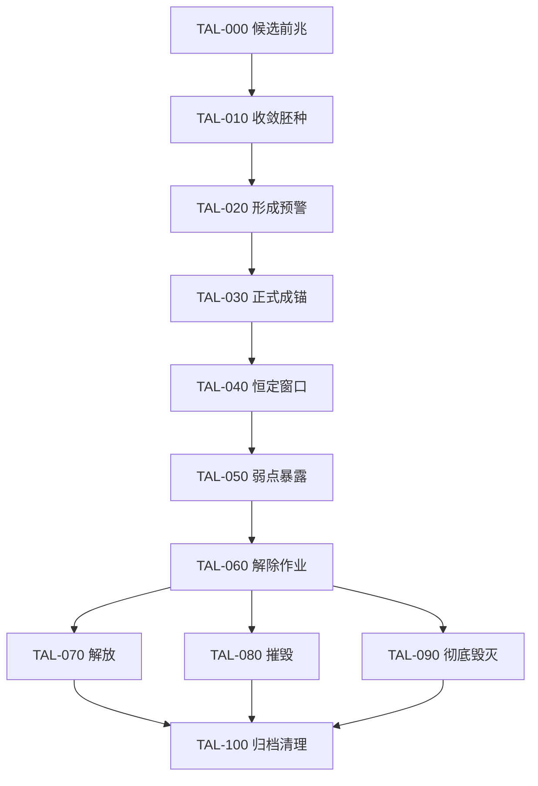

# 1. 文档目的

本文件定义“终局锚点”从前兆出现到最终归档的对象级生命周期，使专属天灾能够把无形的毁灭命运转化为可观测、可预警、可稳定、可研究和可处理的现实目标。

本文件只设计机制边界，不编写 Stellaris 事件、局势、舰队、星系生成或数值脚本。

# 2. 上游约束

本蓝图必须服从：

- [专属终局天灾联合设计](../design/aemusa_exclusive_endgame_crisis_joint_design_v1.0.md)
- [专属天灾状态机蓝图](aemusa_exclusive_crisis_state_machine_blueprint_v1.0.md)
- `JCR-003`：专属舰恒定局部命运，使立即毁灭变成可处理的终局锚点。
- `JCR-006`：局部失败造成真实永久损失，但不得无预警地删除整个玩家帝国。
- `JCR-009`：专属巨构负责全局参照、协调和弱点解析，不直接攻击锚点。
- `JCR-011`：锚点与投影表现为现实被同一终局覆盖后的结构异常，不人格化。
- `SMR-003`：专属舰被毁后在首都重新出现；巨构被占领时暂停新解析并保留既有资料；本剧情阶段爱缪莎不会死亡。
- `SMR-004`：局部失败推动公开终局收敛指标，全局败亡必须经过公开警告和最后应对窗口。
- `SMR-005`：1.0 只按单人模式设计，所有对象和奖励必须持久化且不可重复生成。

# 3. 不在本蓝图决定的内容

- 专属舰正式名称、外观、槽位、数值、部署方式和重现时间。
- 专属巨构正式名称、外观、阶段、造价和精确解析速度。
- 投影舰队的模型、具体编制、武器、数值和 AI 行为。
- 终局收敛指标的精确阈值与增长公式。
- 事件文本、通讯对白、音乐、粒子、美术和镜头。
- Stellaris 4.4.3 的具体脚本对象与作用域映射。
- 隔离原型与正式实现。

# 4. 核心定义

## 4.1 终局锚点

终局锚点不是敌方建设的空间站，也不是拥有意志的生命或 AI。它是某处未来被压缩到只剩毁灭结局后，专属舰暂时恒定当地现实所形成的可处理重叠区。

锚点同时包含：

- 正在被终局结果覆盖的当地现实。
- 被专属舰暂时保持开放的有限未来窗口。
- 利用当地物质、能量、残骸、数据和空间结构形成的无人格投影。
- 可由巨构、科研体系和战场资料逐步识别的结构弱点。
- 若处理失败，将被永久写入现实的具体损失。

## 4.2 候选前兆

候选前兆是尚未满足正式锚点条件的异常记录。它可以被调查、排除或确认，但不生成正式投影，不占用正式锚点唯一编号，也不直接推动局部毁灭结算。

## 4.3 正式锚点

正式锚点必须拥有唯一身份、明确宿主目标、公开损失说明、生命周期状态和一次性结算账本。它从正式形成开始才计入危机压力与终局收敛。

## 4.4 终局投影

投影没有人格、社会、指挥者、外交身份和母文明。它们只是锚点利用当地条件生成的执行结构，用于维护终局覆盖、封锁救援或排除现实反作用。

# 5. 对象数据分层

每个锚点至少需要保存以下概念数据：

## 5.1 身份层

- 唯一锚点编号。
- 宿主星系、星球、轨道设施或其他目标。
- 当前生命周期状态。
- 形成批次与所属危机阶段。
- 是否已经正式结算与归档。

## 5.2 时间层

- 前兆开始节点。
- 形成预警截止节点。
- 专属舰稳定窗口状态。
- 弱点暴露与解除作业节点。
- 局部失败最后应对节点。

## 5.3 风险层

- 提前公开的可能损失类型。
- 当前终局覆盖程度。
- 对公开收敛指标的影响。
- 可救援对象与已发生永久损失。
- 是否属于核心锚点。

## 5.4 研究层

- 已输入巨构的观测、战斗、残骸和空间数据。
- 已验证弱点。
- 尚未验证的候选弱点。
- 巨构被占领时的解析暂停状态。
- 已公开且不可回收的研究成果。

## 5.5 投影层

- 已生成的舰队和设施投影。
- 投影与锚点的绑定关系。
- 已摧毁、失联和待清理对象。
- 是否仍能推动局部覆盖。

# 6. 生命周期共同原则

1. **先预警，后成锚**：正式锚点形成前必须存在可识别提示和公开目标。
2. **唯一身份**：同一宿主、同一形成批次不得重复生成正式锚点。
3. **状态不倒退**：锚点生命周期只向前推进；资产失效通过暂停或恶化处理，不回到前兆。
4. **投影从属**：投影不能脱离所属锚点成为独立文明或永久无源舰队。
5. **资料持久**：已经验证和公开的弱点不会因巨构被占领、专属舰损失或读档而消失。
6. **损失预告**：任何局部永久损失必须在最后处理窗口前公开说明。
7. **结算唯一**：解放、摧毁或彻底毁灭只能结算一次。
8. **不自动复原**：危机胜利不恢复锚点造成的永久损失。
9. **不自动判负**：单个普通锚点失败只产生局部后果和公开压力，不直接触发全局败亡。
10. **实现闸门关闭**：生命周期获批前不开始正式事件与生成脚本。

# 7. 生命周期候选结构

## TAL-000：候选前兆

状态含义：

- 系统记录到未来路径减少、现实基线不一致或多个无关结果同步缺失。
- 尚未确认是终局收敛，也尚未绑定正式毁灭目标。

允许行为：

- 调查、交叉验证、排除误报。
- 记录局部环境、社会、空间与军事异常。

禁止行为：

- 生成正式投影。
- 结算永久毁灭。
- 直接要求专属舰恒定。

## TAL-010：收敛胚种

状态含义：

- 候选前兆已经显示多条未来向同一毁灭结果收敛。
- 巨构与科研体系可以锁定潜在宿主，但仍允许通过证据证明其并非正式锚点。

主要职责：

- 建立唯一候选编号。
- 初步确定风险范围和可能损失类型。
- 准备形成预警。

## TAL-020：形成预警

状态含义：

- 终局锚点即将正式形成。
- 宿主目标、最后准备时间和可能损失必须向玩家公开。

允许行为：

- 撤离人口、舰队和关键资源。
- 调整防线与专属舰部署。
- 收集可降低后续损失或加快解析的前置资料。

边界：

- 预警窗口不可通过读档重置。
- 未及时处理不会隐藏结算，而是进入已说明的正式成锚状态。

## TAL-030：正式成锚

状态含义：

- 当地未来已经被压缩到只剩毁灭结局。
- 专属舰尚未完成恒定时，现实持续向不可逆毁灭推进。
- 锚点获得正式唯一编号并开始影响终局收敛指标。

主要职责：

- 生成第一批从属于锚点的无人格投影。
- 激活公开局部风险和最后应对窗口。
- 接受专属舰恒定行动。

## TAL-040：恒定窗口

状态含义：

- 专属舰将立即毁灭暂时固定为可观测、可研究、可交战的现实重叠区。
- 恒定不是解除；目标仍在持续承受终局覆盖压力。

主要职责：

- 为巨构、科研和舰队取得真实数据。
- 限制锚点继续瞬时压缩未来。
- 维持救援与作战通路。

异常：

- 专属舰被毁后在首都重新出现。
- 重现前恒定能力暂时缺失，锚点不会倒退，风险继续增长。

## TAL-050：弱点暴露

状态含义：

- 巨构结合锚点、投影、战斗、残骸和空间资料，确认可利用的结构缺陷。
- 已公开弱点永久保留。

主要职责：

- 把弱点转化为现实舰队、科研、救援或专属舰可以执行的目标。
- 区分“解除并救回宿主”“破坏锚点但接受宿主损失”等不同解决路径。

异常：

- 巨构被占领时暂停新解析。
- 已知弱点仍可使用，夺回巨构后继续累计资料。

## TAL-060：解除作业

状态含义：

- 玩家已经进入对锚点本体的最终处理阶段。
- 投影压制、弱点利用、专属舰恒定、现实救援和局部工程需要共同完成。

可能结果：

- `TAL-070 解放`。
- `TAL-080 摧毁`。
- `TAL-090 彻底毁灭`。

## TAL-070：解放

候选定义：

- 锚点被解除，宿主现实仍然存在，并重新获得多于一个可行未来。
- 已发生损失保留，但目标没有被终局结果完整覆盖。

## TAL-080：摧毁

候选定义：

- 锚点结构被强制摧毁，正式终局覆盖停止，但宿主目标无法完整保全。
- 这是阻止更大收敛的代价性成功，不等同于无损解放。

## TAL-090：彻底毁灭

候选定义：

- 处理窗口结束，终局结果完整覆盖宿主目标。
- 当地形成已经公开说明的永久毁灭，并提高终局收敛压力。
- 锚点本体完成使命后不再作为无限刷怪源存在。

## TAL-100：归档清理

状态含义：

- 对解放、摧毁或彻底毁灭结果进行一次性结算。
- 保存损失、研究、投影、战场和收敛指标变化。
- 清理或降级残余投影，关闭正式锚点的生成能力。
- 写入永久归档，禁止同一锚点再次形成或重复奖励。

# 8. 生命周期示意

# 9. 锚点与专属天灾主状态关系

| 专属天灾主状态 | 允许的锚点状态 |
| --- | --- |
| `ASM-020 征兆收敛` | 以候选前兆和收敛胚种为主，不生成正式锚点 |
| `ASM-030 危机确认` | 允许形成预警，不在紧急准备窗口结束前无提示正式成锚 |
| `ASM-040 终局锚定战争` | 允许完整生命周期，重点处理普通与区域核心锚点 |
| `ASM-050 银河终局` | 允许完整生命周期，并出现银河核心收敛结构关联锚点 |
| `ASM-060 危机战后` | 不再形成新的正式锚点，只允许归档和残余清理 |
| `ASM-070` 以后 | 禁止重新打开正式锚点生命周期 |

# 10. 角色与系统职责边界

## 10.1 爱缪莎

- 发现未来路径正在异常减少。
- 协助判断恒定后的局部未来是否重新开放。
- 不单独确认全部弱点，不单独摧毁锚点，也不在危机期间拥有玩家授予的命运权限。

## 10.2 专属舰

- 在正式成锚后恒定局部命运。
- 为救援、研究和作战创造有限窗口。
- 被摧毁后在首都重新出现，但缺席期间锚点压力继续。

## 10.3 专属巨构

- 比较现实基线并定位候选前兆。
- 汇总锚点、投影、战斗、残骸和空间资料。
- 解析并公开弱点。
- 被占领时暂停新解析，已知资料保留。

## 10.4 现实舰队与科研体系

- 保护恒定窗口。
- 摧毁投影并取得资料。
- 执行弱点目标、救援和局部工程。
- 承担真实战争成本。

# 11. 保存与幂等要求

- 候选编号与正式锚点编号不得因读档重复创建。
- 候选被排除后必须留下排除账本，不能在同一批次立即重生。
- 正式成锚、首次投影、弱点公开、终局结果和归档奖励均只能执行一次。
- 投影生成必须验证所属锚点仍处于允许状态。
- 锚点归档后，迟到的投影生成与结算回调必须失效。
- 月度维护只能修复缺失引用与异常中断，不能重放前兆、奖励和永久损失。
- 被占领巨构恢复解析时从已保存数据继续，不重新发放已知弱点。

# 12. 审核队列

| 编号 | 审核项 | 当前状态 | 依赖 |
| --- | --- | --- | --- |
| ALR-001 | 生命周期状态数量、顺序与三种结果 | 已批准方案 A | 已批准状态机蓝图 |
| ALR-002 | 候选目标资格、前兆与形成预警 | 待人工决定 | ALR-001 |
| ALR-003 | 专属舰恒定与投影生成关系 | 未开始 | ALR-001、002 |
| ALR-004 | 巨构弱点解析与解除作业 | 未开始 | ALR-001 至 003 |
| ALR-005 | 解放、摧毁、彻底毁灭与归档 | 未开始 | ALR-001 至 004 |
| ALR-006 | 生命周期蓝图验收与下一闸门 | 未开始 | 全部项目 |

# 13. ALR-001：生命周期状态数量、顺序与三种结果

### 13.1 方案 A：十一个状态与三种终局结果（推荐）

采用 `TAL-000` 至 `TAL-100`：

1. 候选前兆。
2. 收敛胚种。
3. 形成预警。
4. 正式成锚。
5. 恒定窗口。
6. 弱点暴露。
7. 解除作业。
8. 解放。
9. 摧毁。
10. 彻底毁灭。
11. 归档清理。

其中“解放、摧毁、彻底毁灭”是互斥结果：

- 解放：保存宿主现实并重新开放多种未来。
- 摧毁：以宿主的重大或不可逆损失换取锚点停止，是代价性成功。
- 彻底毁灭：终局结果完整覆盖宿主，是局部失败。

优势：完整区分预警、恒定、研究、处理与结果，也允许玩家在无法无损解放时选择代价性止损。

风险：对象状态较多，需要严格定义转换与一次性账本。

### 13.2 方案 B：八状态简化生命周期

合并“候选前兆／收敛胚种”“正式成锚／恒定窗口”和“解放／摧毁”，只保留成功与彻底毁灭两种结果。

优势：实现简单，状态较少。

风险：难以表现误报调查、专属舰恒定职责和代价性止损，也容易让锚点退化成普通限时敌人。

### 13.3 方案 C：纯战斗生命周期

从锚点生成开始，只保留出现、无敌、弱点开放、可摧毁和失败五个战斗状态。

优势：最接近传统 Stellaris 危机目标。

风险：删除前兆、救援、现实损失、专属舰恒定和巨构解析的大部分已批准设计，不符合联合叙事结论。

### 13.4 当前建议

建议批准方案 A。十一个状态不是十一段强制剧情，而是对象在调查、恒定、研究、处理和结算中的可验证阶段。三种互斥结果能让“救回目标”“以毁灭局部阻止更大收敛”和“处理失败导致彻底毁灭”拥有清晰区别。

### 13.5 审核结论

- 决定：批准方案 A“十一个状态与三种终局结果”。
- 生命周期固定为 `TAL-000` 至 `TAL-100`。
- `TAL-070 解放`、`TAL-080 摧毁` 与 `TAL-090 彻底毁灭` 是互斥结果。
- “摧毁”被定义为牺牲宿主完整性、阻止更大收敛的代价性成功，不与无损解放混同。
- 三种结果最终都进入一次性的 `TAL-100 归档清理`。
- 批准日期：2026-08-01。

# 14. ALR-002：候选目标资格、前兆与形成预警

本审核项决定锚点如何选择现实宿主，以及玩家在正式成锚前能获得多少信息。目标选择必须表现为命运规律沿既有裂隙收敛，而不是一个拥有意志的敌人进行战略选点。

## 14.1 方案 A：分层资格池、首锚教学保护与双阶段预警（推荐）

### 14.1.1 候选资格池

候选目标分为三类：

1. **人口与生活目标**
   - 殖民星球、居住站或其他拥有明确人口与社会损失语义的地点。
   - 用于表现撤离、救援、基础设施保护和生活世界被终局覆盖的代价。

2. **工程与战略目标**
   - 重要空间站、交通节点、生产设施、科研设施或可以被明确结算的巨型工程周边。
   - 用于表现通路、工业、研究和跨星系协调遭受的现实压力。

3. **战争与残响目标**
   - 近期大战、原版天灾、失落帝国战争或大规模毁灭留下显著现实创伤的星系。
   - 用于表现终局收敛沿战争后果、系统脆弱点和已经关闭的机会扩张。

目标权重来自可验证的现实条件，例如破坏、封锁、人口风险、异常数据、危机残留和未来路径减少；不得使用“敌人想攻击首都”“命运惩罚最强者”等人格化解释。

### 14.1.2 通用排除条件

以下目标不进入正式候选池：

- 已被彻底毁灭、没有可结算现实对象的地点。
- 当前已经拥有未归档正式锚点的同一宿主。
- 正处于不兼容的原版或其他 Mod 强制剧情状态，无法安全保存所有权与毁灭结果的目标。
- 无法显示明确损失、无法提供任何合法响应路径或无法建立唯一对象引用的目标。
- 仅因脚本找不到合格目标而临时创建的无来源星系、星球或殖民地。

同一星系是否允许同时存在多个不同宿主锚点，留待防滚雪球审核；默认不得以重复生成绕过唯一性。

### 14.1.3 首个正式锚点

- 第一座正式锚点承担教学与校准职责。
- 优先从玩家直接控制、能够抵达且不是首都母星的合格目标中选择。
- 不以首都、母星或唯一不可替代剧情目标作为第一次机制教学的宿主。
- 第一座锚点仍会造成真实损失，但必须完整展示前兆、撤离、专属舰恒定、巨构解析和三种结果的基本关系。
- 若没有合格目标，保持候选搜索并明确提示原因，不得强行在无效目标上生成。

首锚保护只服务于机制教学，不代表首都和母星在后续危机中永久免疫。

### 14.1.4 双阶段预警

**候选前兆阶段：**

- 展示异常区域、证据类型和不确定性。
- 允许调查后排除误报或确认收敛胚种。
- 不生成正式投影，不开始永久毁灭结算。

**形成预警阶段：**

- 明确展示正式宿主、剩余准备时间和可能的永久损失类型。
- 标出可撤离对象、建议部署位置、专属舰需求和已知响应路径。
- 说明忽略目标会如何提高公开终局收敛压力。
- 预警时限不可通过读档重置。

### 14.1.5 可达性原则

- 正式预警必须至少提供一条理论上可执行的响应路径。
- 若目标因边境、占领、失联或外交状态暂时不可达，系统必须明确展示阻碍，而不是把它伪装成玩家操作失误。
- 是否提供临时通行、银河共同防御或跨境救援规则，留待 Stellaris 可行性蓝图决定。
- 1.0 不以多人协作作为锚点可解性的前提。

优势：首次接触可学习，后续目标仍具有银河尺度与真实风险；双阶段预警把调查不确定性和正式毁灭倒计时清楚分开。

风险：资格池、排除条件和可达性检查较复杂，需要防止长期找不到候选或只重复选择同一类目标。

## 14.2 方案 B：全银河随机有效目标与单次预警

从所有基础有效目标中随机选择，直接给出正式形成预警，不区分候选前兆和收敛胚种。

优势：生成规则简单，分布更不可预测。

风险：可能连续命中不可达、不可救或价值悬殊的目标；也会削弱三条证据链与前兆调查的作用。

## 14.3 方案 C：固定剧情目标列表

所有锚点按预先编写的星系、星球和设施清单依次出现。

优势：最容易控制剧情、镜头和难度。

风险：不同地图、帝国版图和 Mod 环境下兼容性差，重复游玩完全固定，也容易把无意志的命运收敛写成预设攻击计划。

## 14.4 当前建议

建议批准方案 A。目标不是按军力或叙事便利随机挑选，而是从存在真实可验证脆弱性的分层资格池中产生。首个锚点提供一次非首都、可抵达的完整教学；之后取消首锚保护，但继续执行唯一性、可结算性和双阶段预警要求。
